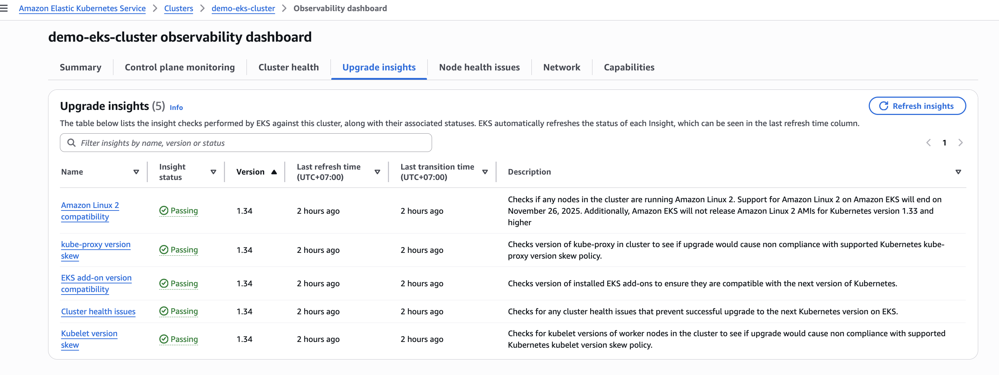
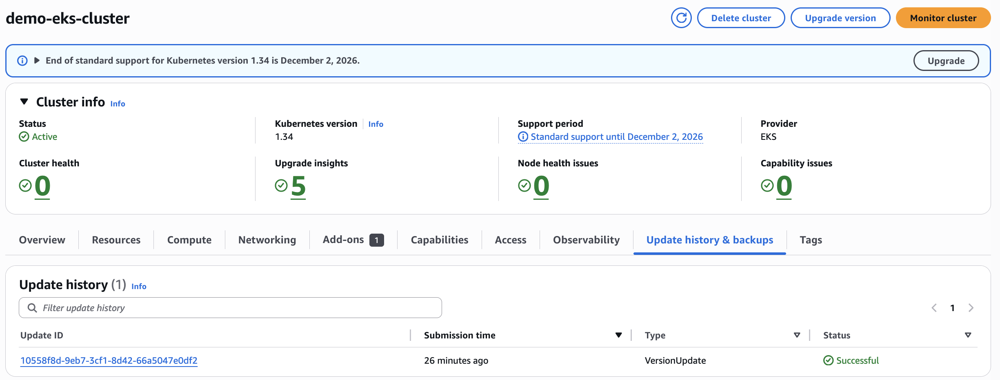
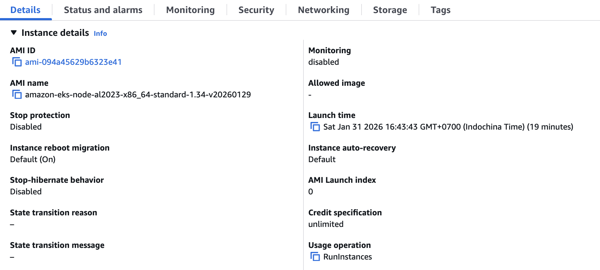

# EKS Upgrade Guide: 1.33 → 1.34

This guide shows how to upgrade your EKS cluster from Kubernetes 1.33 to 1.34.

## Prerequisites

- Cluster running on EKS 1.33
- All workloads healthy
- Backup critical configurations
- kubectl updated to v1.34+ (match cluster version)

## Key Changes in EKS 1.34

- **Containerd**: Updated to 2.1
- **VolumeAttributesClass**: Graduates to GA (only GA version supported)
- **AppArmor**: Deprecated (migrate to seccomp or Pod Security Standards)
- **EBS CSI Driver**: Requires v1.50+ for 1.34 compatibility
- **Karpenter**: Requires v1.6+ for Kubernetes 1.34 support
- **No breaking changes**: No API removals or deprecations from 1.33

## Upgrade Steps

### 1. Pre-Upgrade Validation

**Check EKS Upgrade Insights (AWS Console):**

1. Open AWS Console → EKS → Your Cluster → Observability dashboard → Upgrade insights tab
2. Click "Refresh insights" to get current status
3. Verify all insights show "Passing" for version 1.34:
   - Amazon Linux 2 compatibility
   - kube-proxy version skew
   - EKS add-on version compatibility
   - Cluster health issues
   - Kubelet version skew

If any insight shows "Failing", fix the issue before upgrading.


*Example: All 5 upgrade insights showing "Passing" status for version 1.34*

**Command-line checks:**

```bash
# Verify current cluster version
aws eks describe-cluster --name <cluster_name> --query cluster.version

# Check node versions
kubectl get nodes -o wide

# Verify all pods are healthy
kubectl get pods --all-namespaces

# Check Karpenter version
kubectl get deployment -n karpenter karpenter -o jsonpath='{.spec.template.spec.containers[0].image}'
```

### 2. Update Terraform Configuration

**Update `terraform.tfvars`:**

```hcl
kubernetes_version = "1.34"
```

**Update `addons.tf` - Upgrade Karpenter to 1.6+:**

```hcl
karpenter = {
  # Karpenter >= 1.6 required for Kubernetes 1.34
  chart_version = "1.6.0"
}
```

### 3. Plan the Upgrade

```bash
terraform plan -out=tfplan
```

Review the plan:
- EKS cluster version updates to 1.34
- Karpenter Helm release upgrades to 1.6.0
- EKS managed addons (coredns, kube-proxy, vpc-cni, eks-pod-identity-agent) upgrade to 1.34-compatible versions (most_recent = true)
- Managed node groups use 1.34 AMI when cluster version changes

### 4. Apply Control Plane Upgrade

```bash
terraform apply tfplan
```

**Timeline:**
- Control plane: ~6 minutes
- Karpenter: ~2-3 minutes
- Addons: ~1-2 minutes each
- Worker nodes: ~15 minutes (for 3 nodes, depends on node count and pod drain time)
- Total: ~22-25 minutes

### 5. Verify Control Plane Upgrade

```bash
# Check cluster version
aws eks describe-cluster --name <cluster_name> --query cluster.version
# Should show: "1.34"

# Verify API server is accessible
kubectl get nodes

# Check Karpenter version
kubectl get deployment -n karpenter karpenter -o jsonpath='{.spec.template.spec.containers[0].image}'
```

**Verify in AWS Console:**

Check the Update history tab in the EKS Console to confirm the upgrade completed successfully:



*Example: VersionUpdate showing "Successful" status in Update history*

### 6. Upgrade Worker Nodes

**Option A: Upgrade Managed Node Group (via Terraform)**

The managed node group uses the 1.34 AMI when you update the cluster version. Terraform handles this. To trigger immediate node refresh:

```bash
# Scale down to 0 (pods will move to Karpenter nodes)
# Then scale back up - new nodes will use 1.34 AMI
```

**Note**: The EKS module updates node group AMI when `kubernetes_version` changes. No manual AMI update needed.

**Option B: Use Karpenter**

Karpenter-provisioned nodes use 1.34 AMIs when new nodes are created. Existing nodes are replaced as workloads are rescheduled.

**Manual node group upgrade:**

```bash
# Get current node group
aws eks describe-nodegroup --cluster-name <cluster_name> --nodegroup-name initial

# Update node group AMI (Terraform handles this)
# Or manually update via AWS Console/CLI
```

### 7. Verify Node Versions

```bash
kubectl get nodes -o custom-columns=NAME:.metadata.name,VERSION:.status.nodeInfo.kubeletVersion
```

All nodes should show: `v1.34.x-eks-xxxxx`

**Verify worker node AMI in AWS Console:**

Check EC2 instances to confirm nodes are using the 1.34 AMI:



*Example: EC2 instance showing AL2023 AMI for Kubernetes 1.34 (`amazon-eks-node-al2023-x86_64-standard-1.34-v20260129`)*

### 8. Post-Upgrade Validation

```bash
# Check all pods are running
kubectl get pods --all-namespaces

# Verify addon versions
kubectl get daemonset -n kube-system kube-proxy -o jsonpath='{.spec.template.spec.containers[0].image}'
kubectl get deployment -n kube-system coredns -o jsonpath='{.spec.template.spec.containers[0].image}'

# Check Karpenter status
kubectl get nodeclaims
kubectl get nodepools

# Test workload scheduling
kubectl apply -f k8s/test-karpenter.yaml
kubectl get pods -w
```

### 9. Upgrade kubectl Client (if needed)

```bash
# macOS
brew upgrade kubectl

# Linux
curl -LO "https://dl.k8s.io/release/$(curl -L -s https://dl.k8s.io/release/stable.txt)/bin/linux/amd64/kubectl"
chmod +x kubectl
sudo mv kubectl /usr/local/bin/

# Verify version
kubectl version --client
```

## Expected Addon Versions for EKS 1.34

With `most_recent = true` in Terraform, addons upgrade to these versions:

- **CoreDNS**: v1.12.4-eksbuild.1
- **kube-proxy**: v1.34.0-eksbuild.4
- **VPC CNI**: v1.20.3-eksbuild.1
- **EBS CSI Driver**: v1.50.0+ (if using)
- **Karpenter**: v1.6.0+

**Note**: This project uses `most_recent = true` for managed addons, so versions update without manual changes. The article pins versions explicitly, which also works but requires manual version updates.

## Troubleshooting

### Nodes Not Joining After Upgrade

- Check EKS Access Entry for Karpenter node role (AL2023 requirement)
- Verify security groups allow communication
- Check node logs: `aws ec2 get-console-output --instance-id <id>`

### Karpenter Not Provisioning Nodes

- Verify Karpenter version >= 1.6.0
- Check NodePool and EC2NodeClass are Ready
- Review Karpenter logs: `kubectl logs -n karpenter -l app.kubernetes.io/name=karpenter`

### Addon Upgrade Failures

- Check addon compatibility with 1.34
- Review addon logs in kube-system namespace
- Use `resolve_conflicts = "OVERWRITE"` if needed (already set in Terraform)

## Rollback

EKS does not support rolling back the control plane. Upgrades are one-way only. If the upgrade causes problems:

1. Fix issues in place on version 1.34
2. Or create a new cluster on 1.33 and migrate workloads

You can rollback addons (like Karpenter) by reverting their versions in Terraform:

```bash
# Revert addons.tf
karpenter = {
  chart_version = "1.5.0"
}

terraform apply
```

This only affects addon versions, not the control plane version.

## References

- [EKS Release Notes](https://docs.aws.amazon.com/eks/latest/userguide/kubernetes-versions.html)
- [Kubernetes 1.34 Changelog](https://github.com/kubernetes/kubernetes/blob/master/CHANGELOG/CHANGELOG-1.34.md)
- [Karpenter Compatibility](https://karpenter.sh/docs/upgrading/compatibility/)
- [EKS Upgrade Guide](https://docs.aws.amazon.com/eks/latest/userguide/update-cluster.html)
